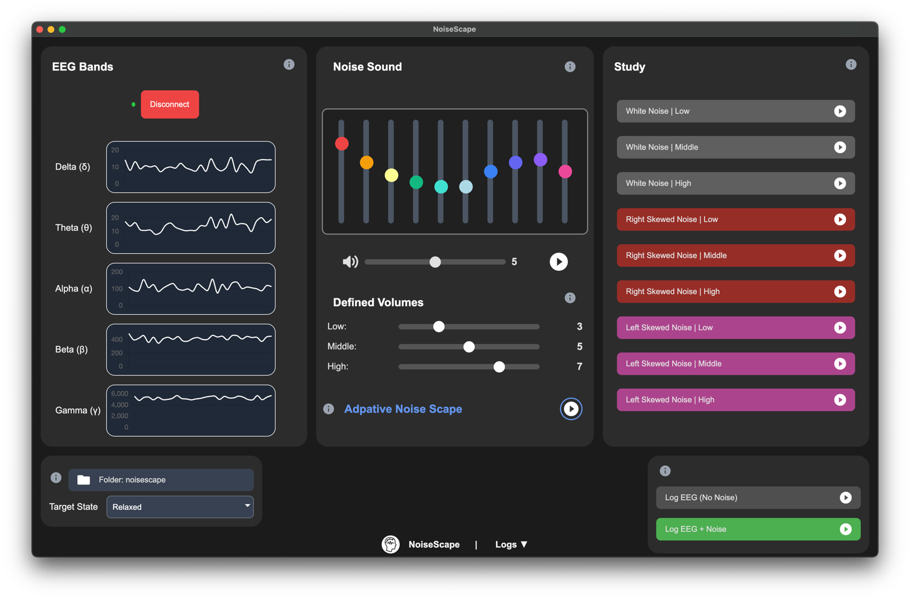

<p align="center">
  
</p>

<h1 align="center">NoiseScape</h1>

<p align="center">
  <strong>EEG-Guided Adaptive Noise Experiments</strong><br>
  A research tool for analyzing how noise types and volume affect brainwaves.
</p>

<p align="center">
  <a href="#features">Features</a> •
  <a href="#purpose">Purpose</a> •
  <a href="#eeg--simulation-modes">EEG Mode</a> •
  <a href="#volume-calibration">Volume Calibration</a> •
  <a href="#data-logging-format">Data Format</a> •
  <a href="#cognitive-states--evaluation-logic">State Evaluation</a> •
  <a href="#getting-started">Getting Started</a>
</p>

<hr>

# NoiseScape – EEG-Guided Adaptive Noise Experiments

**NoiseScape** is an experimental research tool designed for evaluating how different types and volumes of ambient noise affect brainwave activity, using EEG data.

Built for cognitive science, neuroscience, and human performance labs, NoiseScape lets researchers adapt noise playback in real-time, log EEG data, and identify the optimal sound configuration for targeted brain states like *relaxation*, *focus*, or *meditation*.

---

## Purpose

NoiseScape enables researchers to:

- Conduct controlled studies using real EEG data from a **Cyton OpenBCI headset**
- Define custom **low / medium / high** volume thresholds tailored to each test subject
- Log EEG activity during playback of **white, pink, and brown noise**
- Run adaptive evaluation to determine which noise setting best promotes a chosen brain state

---

## UI Overview

The interface is organized into three main panels:
- **EEG Bands Panel**: Shows real-time brainwave activity.
- **Noise Panel**: Choose noise color, volume, and playback.
- **Study Panel**: Launch noise-state experiments for logging.



---

## EEG + Simulation Modes

- With a **Cyton EEG headset**, real-time EEG data is streamed and recorded (Alpha, Beta, Delta, Theta, Gamma)
- Without the headset, **simulated EEG data** is used for testing and UI evaluation (ideal for development or demos)

---

## Volume Calibration

Researchers define what is considered **Low**, **Medium**, and **High** volume for each individual test subject. This allows personalization across subjects with different auditory sensitivities.

---

## Features

- Support for **white**, **pink**, and **brown** noise types
- Tracks **Alpha**, **Beta**, **Delta**, **Theta**, and **Gamma** bands
- Choose desired cognitive states to evaluate: `Relaxed`, `Focused`, `Alert`, or `Meditative`
- Adaptive scoring algorithm selects best noise configuration based on EEG metrics
- Auto-logs results to structured JSON format
- State selector for research mode targeting

---

## Data Logging Format

Each session logs EEG data by **noise type** and **volume level**, stored in `noisecape-experiment.json` in the over the UI selected output directory.

Example content:

```json
{
  "white": {
    "low": [],
    "middle": [],
    "high": [
      { "alpha": 110, "beta": 450, "delta": 10, "gamma": 5000 }
    ]
  },
  "pink": {
    "middle": [...],
    "high": []
  },
  ...
}
```
## Cognitive States + Evaluation Logic

NoiseScape currently supports four target states. During adaptive evaluation, the app scores each recorded condition based on the following criteria:

| State          | Goal (Scoring Logic)                          |
| -------------- | --------------------------------------------- |
| **Relaxed**    | Maximize `alpha`                              |
| **Focused**    | Maximize `beta` + `alpha`, penalize `delta`   |
| **Alert**      | Maximize `beta` + `gamma`                     |
| **Meditative** | Maximize `theta`, moderate `alpha` around 100 |

Evaluation is based on average values across sessions, with weighted contributions per band and penalties for excessive or insufficient values.

## Tests

Run tests for both evaluation logic and integration:

```bash
npm install
npm test
```

Covers:

- EEG scoring (evaluateGroup)
- Adaptive group selection
- Edge cases (missing data, improper config)

## Getting Started

1. Install Dependencies
```bash
npm install
```

2. Run NoiseScape
```bash
npm run
```

> **_NOTE:_** Requires an OpenBCI Cyton device for real EEG input.

## Contributors

This project was developed by us — a group of students at Ludwig Maximilian University of Munich (LMU) — as part of the Praktikum: Practical Physiological Computing (SoSe 2025).

We built NoiseScape to explore how different noise environments influence brain activity, and to provide researchers with a tool to measure and adapt these effects using real-time EEG data.